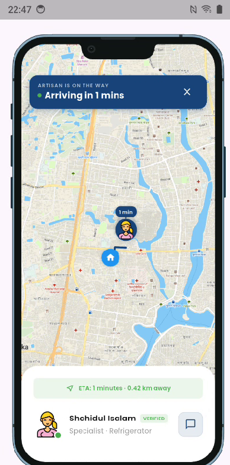
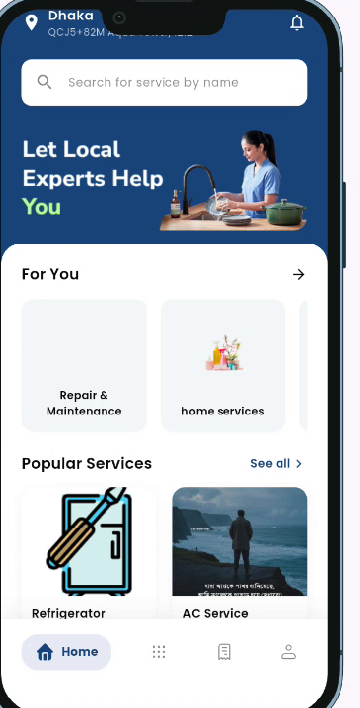
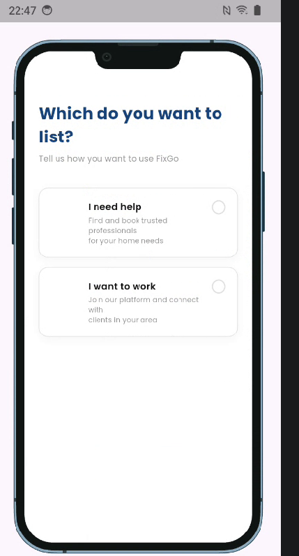
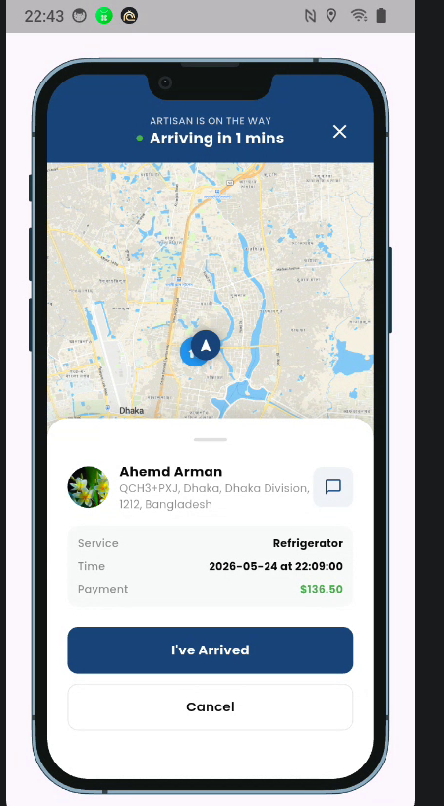
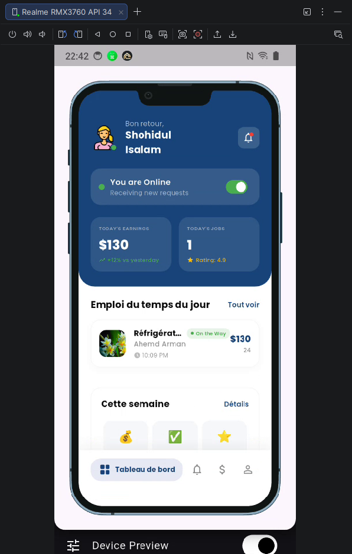

# Artisan

A comprehensive Flutter application designed to provide various home and professional services seamlessly.

## Overview

Artisan is a robust mobile application built with Flutter, focused on connecting users with essential services like Cleaning, Repair & Maintenance, Home Improvement, and more. It leverages modern architecture and a powerful set of libraries to deliver a highly responsive and feature-rich user experience.

### Core Functionalities (What this app does)
- **On-Demand Home Services:** Users can browse and book various services such as:
  - Cleaning Service
  - Repair & Maintenance
  - Installation Service
  - Home Improvement
  - Moving & Shifting
  - Garden Cleaning
- **Location Tracking:** Integrated map and geolocation to pinpoint service addresses and track service providers.
- **Invoices & Documentation:** Automatically generate PDF invoices and print them directly from the app.
- **Digital Signatures:** Allow customers and technicians to sign off on completed jobs digitally.
- **Visual Analytics:** Interactive charts (using fl_chart) for tracking service history or provider earnings.

## Screenshots

<div align="center">
  
  
  
  
  
</div>

### Key Features & Technologies
- **State Management & Routing:** [GetX](https://pub.dev/packages/get)
- **Networking:** [Dio](https://pub.dev/packages/dio) & [http](https://pub.dev/packages/http)
- **Maps & Location:** [flutter_map](https://pub.dev/packages/flutter_map), [geolocator](https://pub.dev/packages/geolocator), and [geocoding](https://pub.dev/packages/geocoding)
- **UI & Responsiveness:** [responsive_framework](https://pub.dev/packages/responsive_framework)
- **Data Visualization:** [fl_chart](https://pub.dev/packages/fl_chart)
- **Typography:** Custom local fonts (Inter, Poppins) and [google_fonts](https://pub.dev/packages/google_fonts)
- **PDF & Printing:** [pdf](https://pub.dev/packages/pdf) and [printing](https://pub.dev/packages/printing)
- **Signatures:** [signature](https://pub.dev/packages/signature)

## Getting Started

To get a local copy up and running, follow these simple steps.

### Prerequisites

- Flutter SDK (version 3.10.7 or higher)
- Dart SDK

### Installation

1. Clone the repository
2. Install dependencies:
   ```bash
   flutter pub get
   ```
3. Run the application:
   ```bash
   flutter run
   ```

## Project Structure

- `lib/` - Main application code.
- `assets/` - Contains all static assets including:
  - Custom Google Fonts (Inter, Poppins)
  - Various Icons organized by categories (Cleaning Service, Repair & Maintenance, etc.)
  - Images for different app sections (home, popular services, notifications)

## Resources

For help getting started with Flutter development, view the
[online documentation](https://docs.flutter.dev/), which offers tutorials,
samples, guidance on mobile development, and a full API reference.
